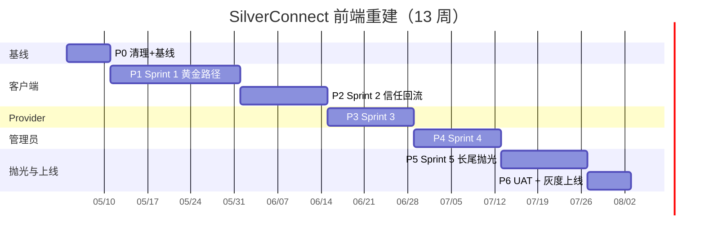

# SilverConnect Global — 前端重建开发计划

> 配套文档：[UI_DESIGN.md](UI_DESIGN.md) · [UI_PAGES.md](UI_PAGES.md) · [ARCHITECTURE.md](ARCHITECTURE.md) · [REQUIREMENTS.md](zh/REQUIREMENTS.md)
>
> 决策：**前端 UI 全量重建**。后端 API（`app/api/**`）、数据库（Supabase）、AI 服务（FastAPI）、`lib/**` 业务逻辑 **全部保留**。

---

## 0. 范围与基线

### 0.1 保留（不动）

| 目录 / 资产 | 说明 |
|---|---|
| `app/api/**` | 19 个 REST 端点（booking, payment, dispute, AI 等），与新 UI 对接 |
| `lib/**` | 定价、可用性、匹配、Stripe 工具、translations、types |
| `ai_customer_service.py` | FastAPI AI 服务 |
| Supabase 迁移 (`lib/schema.sql` + `migrations/`) | 数据模型与 RLS |
| `__tests__/`, `e2e/`, `k6/` | 测试用例做适配，不删 |
| 配置文件 | `next.config.*`, `tailwind.config.*`, `tsconfig.json`, `eslint.config.mjs`, `vercel.json` |

### 0.2 删除（重做）

| 目录 / 文件 | 处置 |
|---|---|
| `app/` 下除 `api/`、`layout.tsx`、`globals.css`、`favicon.ico` 外所有路由 | **整体删除**：`agedcare/` `booking/` `bookings/` `dashboard/` `emergency/` `providers/` `services/` `support/` |
| `components/**` 下所有 `.tsx` 旧组件 | **整体删除**，新建 `components/{ui,layout,domain}/` 三层结构 |
| `app/page.tsx` | 替换为新落地页 (#1) |
| `app/layout.tsx` | 重写：i18n provider + theme + 全局 chrome |
| `app/globals.css` | 重写：注入 §1.1 设计 token CSS 变量 |

### 0.3 技术栈基线（确认 / 引入）

| 类别 | 选型 | 说明 |
|---|---|---|
| 框架 | **Next.js 16 App Router + React 19** | 已在用 |
| 语言 | TypeScript strict | 已在用 |
| 样式 | **Tailwind CSS** + CSS 变量（§1.1 token） | 已在用 |
| 组件库 | **自建 + shadcn/ui 选用** | 不引入完整 UI lib，按 UI_DESIGN.md token 自建 |
| i18n | **next-intl**（替换 `lib/translations.ts` 的简易 dict） | EN/ZH 完整 locale 路由 `/[locale]/...` |
| 状态 | React Server Components + URL state + `nuqs` | 不引入 Redux/Zustand 除非确有共享状态 |
| 表单 | **react-hook-form + zod** | 表单页 (#12, #38, etc.) 重度使用 |
| 数据 | **Supabase JS client + TanStack Query**（客户端缓存） | RSC 默认服务端取数 |
| 支付 UI | **@stripe/stripe-js + @stripe/react-stripe-js** | Stripe Elements |
| 图标 | **lucide-react** + 自定义线条插画 SVG | 见 §1.4 / §1.8 |
| 动效 | **framer-motion**（最小化使用） + 原生 CSS | §1.7 / §1.8.4 |
| 日期 | **date-fns** + `date-fns-tz` | 跨时区订单 |
| 测试 | **Jest（沿用 `jest.config.js`）+ Playwright（E2E，沿用 `e2e/`）** | 不迁移 Vitest，避免动测试基线 |
| 数据表 | **TanStack Table v8** | 管理员 #53 #54 #57 #59 等数据网格 |
| 监控 | **Sentry**（按 ARCHITECTURE 计划项落地） | Sprint 4 引入 |

### 0.4 路由结构（新）

```
app/
├── api/                     # 保留全部
├── [locale]/                # 新增：next-intl 中间件
│   ├── (public)/            # 未登录可访问
│   │   ├── page.tsx                  # #1 落地页
│   │   ├── auth/{login,register,forgot,reset,verify}/page.tsx  # #2-#6
│   │   └── help/[[...slug]]/page.tsx # #33 #34
│   ├── (customer)/          # 客户端，登录后
│   │   ├── home/page.tsx             # #7
│   │   ├── services/[[...cat]]/page.tsx       # #8 #9
│   │   ├── providers/[id]/page.tsx           # #10
│   │   ├── search/page.tsx                   # #11
│   │   ├── bookings/{,new,recurring,[id]/...}/page.tsx  # #12-#17, #30, #31
│   │   ├── pay/[bookingId]/page.tsx          # #13
│   │   ├── notifications/page.tsx            # #28
│   │   ├── chat/page.tsx                     # #29
│   │   ├── safety/report/page.tsx            # #32
│   │   ├── profile/...                       # #18-#27
│   │   └── settings/{privacy,account}/page.tsx  # #35 #36
│   ├── (provider)/
│   │   └── provider/...                      # #37-#50
│   ├── oops/page.tsx                         # #67
│   └── not-found.tsx                         # #68
├── admin/                   # 顶层路由，仅 EN，**middleware 排除 /admin 前缀的 locale 重定向**
│   ├── login/page.tsx                        # #51
│   ├── (authed)/                             # 受保护，layout 强制 TOTP 已通过
│   │   ├── page.tsx                          # #52 主控台
│   │   ├── disputes/page.tsx                 # #53 (含抽屉)
│   │   ├── safety/page.tsx                   # #54
│   │   ├── reports/page.tsx                  # #55
│   │   ├── refunds/page.tsx                  # #56
│   │   ├── providers/[[...id]]/page.tsx      # #57 #58
│   │   ├── customers/[[...id]]/page.tsx      # #59 #60
│   │   ├── bookings/page.tsx                 # #61
│   │   ├── payments/page.tsx                 # #62
│   │   ├── analytics/page.tsx                # #63
│   │   ├── ai/{conversations,kb}/page.tsx    # #64 #65
│   │   └── settings/page.tsx                 # #66
├── layout.tsx               # 重写
└── globals.css              # 重写
```

---

## 1. 阶段划分总览

| Phase | 主题 | 时长（人周） | 交付里程碑 |
|---|---|---|---|
| **P0** | 清理 + 基线搭建 | 1 周 | 旧 UI 删除、Token/Layout/i18n/路由骨架可跑 |
| **P1** | Sprint 1 客户黄金路径 | 3 周 | #7 #8 #9 #10 #12 #13 #14 #15 #16 #28 #29 共 14 屏可演示 + E2E 通过 |
| **P2** | Sprint 2 信任与回流 | 2 周 | 注册登录、个人资料、评价、争议、安全、紧急覆盖 11 屏 |
| **P3** | Sprint 3 Provider 核心 | 2 周 | Provider **10 页**核心可用 + Stripe Connect 接入（剩 4 页入 P5）|
| **P4** | Sprint 4 管理员核心 | 2 周 | 管理员 **8 屏 + 5 抽屉** + #66 系统设置（剩 7 页入 P5），仅桌面 |
| **P5** | Sprint 5 长尾 + 抛光 | 2 周 | 剩余 **29 路由**（公共 4 + 客户 11 + Provider 4 + 管理员 8 + 错误 2）+ 模态收尾 + Sentry + a11y/性能/双语终审 |
| **P6** | UAT + 上线 | 1 周 | 灰度 5% → 50% → 100% |

**总计：13 人周**（单人节奏），2 人并行可压到 7-8 周。

---

## 2. P0 — 清理 + 基线（Week 1）

### 2.1 任务

| # | 任务 | 产出 | 所需 |
|---|---|---|---|
| P0-1 | 备份当前分支：`git branch backup/old-ui-2026-05` | 安全网 | git |
| P0-2 | 删除 §0.2 范围内所有旧路由与组件 | 干净的 `app/[locale]` 与 `components/` 空骨架 | rm -rf |
| P0-3 | 引入 `next-intl`：`messages/{en,zh}.json` + `middleware.ts`（**显式排除 `/admin/*`、`/api/*`、`/_next/*` 不做 locale 重定向**）+ 迁移 `lib/translations.ts` | `/en /zh` 可切换；`/admin` 不被前缀化 | next-intl docs |
| P0-4 | 写入 §1.1 全部 CSS 变量到 `app/globals.css`（浅色 + 深色 + 配色契约） | token 可用 | UI_DESIGN.md §1.1 |
| P0-5 | 配 `tailwind.config.ts` 引用 token 变量 + 字号阶梯 + 触控尺寸 | Tailwind class 可消费 token | UI_DESIGN.md §1.2 §1.3 |
| P0-6 | 重写 `app/layout.tsx`：HTML lang/dir、字体加载（Inter + Noto Sans SC）、ThemeProvider | 全局 chrome 就位 | — |
| P0-7 | 建立 `components/ui/`（Button、Input、Card、Badge、Modal、Toast）按 UI_DESIGN.md §2.4 | 通用原子组件 ≥10 个 | UI_DESIGN.md §2 |
| P0-8 | 建立 `components/layout/` (Header §2.1, BottomTabBar §2.2, AIFloatButton §2.3) | 全局壳 | UI_DESIGN.md §2 |
| P0-9 | 建立 `components/illustrations/` 角色 C1–C10 + 场景 S1–S10 SVG 占位（先用线稿草图占位，与 Claude Design 出稿同步替换） | 10+10 占位 SVG | UI_DESIGN.md §1.8 |
| P0-10 | 配 Storybook 或路由 `/_dev/components` 内部预览页 | 设计师/QA 可独立查 | — |
| P0-11 | CI 加 `lint:contrast`：脚本扫描 token 组合是否违反 §1.1 配色契约 | 自动防回归 | 简单 node 脚本 |

### 2.2 验收

- [ ] `pnpm dev` 跑起 `/en` `/zh` `/en/_dev/components` 三页
- [ ] Header 切语言能 hot-swap，不刷新
- [ ] 浅色 / 深色切换通过 `prefers-color-scheme` 与手动开关同时工作
- [ ] 所有原子组件在 `/_dev/components` 各出 浅 EN/浅 ZH/深 EN/深 ZH 4 态
- [ ] CI 通过

---

## 3. P1 — Sprint 1 客户黄金路径（Week 2-4）

> 14 屏，对应 [UI_PAGES.md §6 Sprint 1](UI_PAGES.md#sprint-1--客户黄金路径14-屏)。每屏走"出图 → 实现 → 联调 → 评审"四步。

### 3.1 任务清单（按依赖排序）

| 周 | 页面 / 功能 | 后端 API | 关键风险 |
|---|---|---|---|
| W2-D1-2 | #7 `/home` 首页 | `GET /api/services`、`GET /api/customer/recent` | 插画占位待 Claude Design 替换 |
| W2-D3 | #8 `/services` 大类列表 | `GET /api/services` 按国别 | 国别价含税 (FR-01) |
| W2-D4-5 | #9 `/services/[cat]` Provider 列表 + 筛选/排序 | `POST /api/provider/search` | 距离计算 `lib/locationUtils.ts` |
| W3-D1-2 | #10 `/providers/[id]` Provider 详情 | `GET /api/provider/[id]`、`GET /api/provider/[id]/availability`、`GET /api/provider/[id]/reviews` | 可用时段预览组件复用 #12 Step 2 |
| W3-D3-4 | #12 `/bookings/new` 预订向导 4 步 | `POST /api/booking/quote`、`POST /api/bookings` | react-hook-form + zod 跨步验证 |
| W3-D5 | #13 `/pay/[bookingId]` 支付页 | `POST /api/create-payment-intent`、Stripe webhook | Stripe Elements 嵌入、3DS |
| W4-D1 | #14 `/bookings/[id]/success` 支付成功 | webhook 回流后状态 | 加日历 ICS 文件生成 |
| W4-D2 | #15 `/bookings` 我的预订列表 | `GET /api/bookings?tab=` | 分页 / 下拉刷新 |
| W4-D3 | #16 `/bookings/[id]` 详情 | `GET /api/bookings/[id]`、`PATCH` 改约/取消 | BookingStatusFlow 组件、按状态条件渲染 |
| W4-D4 | #28 `/notifications` 通知中心 | `GET /api/notifications`、SSE 实时 | SSE / 轮询权衡 |
| W4-D5 | #29 `/chat` AI 聊天 | `POST /api/ai/chat` 流式 | 流式 SSE 渲染、紧急关键词触发 |

### 3.2 横切组件（W2 同步建）

- `BookingStatusFlow`（#16 #41 详情时间线）
- `ProviderCard`（#9 #10 #25 列表/收藏）
- `PriceBreakdown`（#12 Step 4 #13 #16 价格明细）
- `EmergencyOverlay`（#29 + 任意客户/Provider 页全局挂载）
- `PaymentMethodPicker`（#13 #22 共用）
- `Calendar`（月历）+ `TimeSlotGrid`（#12 Step 2、#10 预览、#42）
- `AddressPicker`（#12 Step 3、#15、#21）
- `RatingStars`（#10 #30 #49 三处展示/输入）

> P0 已建的 `Header` `BottomTabBar` `AIFloatButton` 已含 `CountrySelector` `LanguageSelector` 子组件，P1 直接消费。

### 3.3 测试

- 单元：组件 props 与状态切换
- 集成：BookingForm 4 步完整流（mock API）
- E2E（Playwright）：注册 → 浏览 → 预订 → 支付（Stripe test mode）→ 看到 success
- a11y：axe-core 在 CI 跑全部 14 屏

### 3.4 验收

- [ ] 14 屏 `浅色 EN + 浅色 ZH` 全可演示
- [ ] E2E 黄金路径通过（含 Stripe test card 4242）
- [ ] 所有屏对比度 ≥ AAA（脚本验证）
- [ ] 双语无并排（脚本扫描 `>.+\s.+<` 类拼接）
- [ ] Lighthouse Perf ≥ 0.9 于 `/`、`/services`、`/bookings`（PRD §6 NFR）

---

## 4. P2 — Sprint 2 信任与回流（Week 5-6）

11 屏：#2 #3 #18 #22 #30 #31 #32 ⊞ EmergencyOverlay #25 #26 #33

### 4.1 关键任务

| 任务 | 重点 |
|---|---|
| #2 #3 #4 #5 #6 认证全流程 | Supabase Auth + 邮箱验证 + 社交登录（Google / Apple） |
| #18-#27 个人资料 10 页 | 共用 `ProfileLayout` 列表壳；地址/支付为子流程 |
| #22 #23 支付方式 | Stripe SetupIntent + 默认卡管理 |
| #30 评价 | FeedbackForm + 触发 `release_escrow(booking_id)` (FR-04) |
| #31 争议 | DisputeForm + 状态进入管理员 #53 队列 |
| #32 + ⊞ EmergencyOverlay | 关键词检测共享 `lib/emergency.ts`；国家自动选号（AU 000 / CN 120 / CA 911） |
| #33 #34 帮助 | KB 静态化 + Markdown 渲染 |

### 4.2 验收

- [ ] 注册新用户 → 验邮箱 → 走完黄金路径 + 评价 → 争议 → 紧急触发 五条路均通
- [ ] 紧急覆盖在 3 国 locale 下号码正确
- [ ] FR-04 释放托管经评价提交触发可见 DB 行变化

---

## 5. P3 — Sprint 3 Provider 端核心（Week 7-8）

**10 页**（与 UI_PAGES.md Sprint 3 一致）：#37 #38 #40 #41 #42 #43 #45 #46 #49 #50。
剩余 4 页 **入 P5**：#39 审核进度 / #44 屏蔽时间 / #47 个人主页 / #48 服务定价。

### 5.1 关键任务

| 任务 | 重点 |
|---|---|
| #38 注册 5 步向导 | 资质上传 → Supabase Storage + RLS；国别要求差异 |
| #39 审核进度 | Provider 状态机 §7（SUBMITTED → KYC_REVIEW → BACKGROUND_CHECK → STRIPE_PENDING → ACTIVE） |
| #37 工作台 + #41 任务详情 | 状态按钮序列 接受/出发/到达/完成；完成触发客户 #16 待确认完成 |
| #43 周可用 | 复用 `lib/availability.ts`；编辑后写入 `provider_availability` |
| #45 #46 收入与提现 | 读 `payment_transactions`、`payouts`；Stripe Connect 账号状态展示 + 重新验证回链 |
| #49 评价 + ⊞ ReplyReviewModal | 一次性回复约束（DB unique constraint） |
| #50 资质 + ⊞ UploadDocModal | 30 日到期黄字提醒 + Cron 提醒（Vercel Cron） |

### 5.2 验收

- [ ] Provider 完整注册 → 审核通过 → 接单 → 完成 → 收款 走通
- [ ] FR-07 阻止未验证 Stripe Connect 账号 payout（与后端联调）

---

## 6. P4 — Sprint 4 管理员核心（Week 9-10）

**8 关键屏 + 5 抽屉**（与 UI_PAGES.md Sprint 4 一致）：#51 #52 #53 ⊞DisputeDrawer #54 ⊞SafetyDrawer #56 #57 ⊞ProviderApproveDrawer #63 + #66 系统设置（轻量）。
剩余 7 页 **入 P5**：#55 评价举报 / #58 Provider 全档案 / #59 #60 #61 客户与订单 / #64 #65 AI 与 KB。
桌面优先（≥1024px），移动端访问跳"请用桌面"提示页。

### 6.1 关键任务

| 任务 | 重点 |
|---|---|
| #51 登录 + TOTP | Supabase Auth + `otplib` |
| #52 主控台 | 关键指标（PRD §7）+ 实时告警 SSE |
| #53 #54 争议/安全列表 | TanStack Table + URL state 筛选 |
| ⊞ DisputeDrawer / SafetyDrawer | 决策按钮 → API 串通 → Stripe 退款 |
| #57 + ⊞ ProviderApproveDrawer | 资质项逐条勾选 + 退回理由模板 |
| #56 退款队列 | Stripe refund + webhook 状态回流 |
| #63 数据分析 | `recharts` + 数据 SQL view |

### 6.2 验收

- [ ] 客户提交争议 → 管理员裁决退款 → Stripe 实退 → 客户 #16 看到状态变 全链路 ≤ 3min
- [ ] 管理员所有决策落 `audit_log` 表
- [ ] 仅 ≥1024px 可访问，移动端跳"请用桌面"提示页

---

## 7. P5 — Sprint 5 长尾 + 抛光（Week 11-12）

### 7.1 任务

- **剩余 29 路由**（68 - 11 - 10 - 10 - 8 = 29，按路由非"屏"数）：
  - 公共/认证长尾 4 页：#1 落地页 / #4 #5 #6 找回密码 + 重置 + 邮箱验证
  - 客户长尾 11 页：#11 #17 #19 #20 #21 #23 #24 #27 #34 #35 #36
  - Provider 长尾 4 页：#39 #44 #47 #48
  - 管理员长尾 8 页：#55 #58 #59 #60 #61 #62 #64 #65
  - 错误兜底 2 页：#67 #68
  - 模态收尾：⊞ DeleteCardConfirm / InviteFamilyModal / ReportReviewModal / ConversationDrawer / CustomerDrawer 等
- 引入 **Sentry**（前后端）
- 引入 **Upstash Rate Limit** 在 `/api/ai/*` 与 auth（ARCHITECTURE 计划项）
- a11y 全量复测：axe-core 全屏扫描 + 屏幕阅读器（NVDA + VoiceOver）人工抽 5 个核心屏
- 双语 QA：母语审校 EN（澳洲英语）+ ZH（简体）所有 UI 文案
- 性能：Lighthouse 全屏跑分 + 优化 LCP/CLS；图片走 `next/image` + AVIF
- 移动端真机：iPhone SE / iPhone 15 / Pixel 7 / 老安卓机（性能基线）
- 微动画 §1.8.4 接入并尊重 `prefers-reduced-motion`

### 7.2 验收

- [ ] 所有 68 页可访问
- [ ] Sentry 错误率基线 < 0.5%
- [ ] Lighthouse 全 4 项 ≥ 0.9 在核心 10 屏
- [ ] 屏幕阅读器抽测无致命漏读

---

## 8. P6 — UAT + 上线（Week 13）

### 8.1 任务

| 步骤 | 操作 |
|---|---|
| UAT | 业务方 + 真实老人测试者 **15 人**（每国 5 人，中/英母语各半）跑 5 个场景（注册/预订/支付/评价/紧急）|
| 灰度 | Vercel 边缘配置：5% → 24h 观察 → 50% → 24h → 100% |
| 回滚预案 | 保留 `backup/old-ui-2026-05` 分支 + Vercel 即时回滚 |
| 公告 | 现有用户邮件 + 应用内 banner，告知改版 |

### 8.2 上线门槛

- [ ] 所有 P0-P5 验收清单通过
- [ ] PRD §6 NFR 全部达标（可用性 99.5% / Lighthouse / a11y / RLS / i18n）
- [ ] 6 项 PRD §7 成功指标基线监控就位

---

## 9. 视觉稿出图策略（分级，重要）

**不是 68 页全部都需要 Claude Design 出高保真视觉稿。** 按以下三级处理，控制设计成本同时保证一致性。

### 9.1 三级分类

| 级别 | 出图要求 | 数量 | 适用 |
|---|---|---|---|
| **Tier 1 必出高保真** | Claude Design 出稿（浅色 EN + 浅色 ZH，必要时加深色变体），人工评审循环至通过 | ~25 屏 | 风格定调屏 + 每个 Sprint 的旗舰功能 |
| **Tier 2 套用模板** | 不单独出图，工程师按同 Sprint 内 Tier 1 屏的样式与组件直接实现 | ~30 屏 | 与 Tier 1 屏结构高度一致的子页（如 10 个 profile 子页都套 ProfileLayout） |
| **Tier 3 文字驱动** | 仅看 UI_PAGES.md 功能清单 + UI_DESIGN.md 组件规范实现，无视觉稿 | ~13 屏 | 错误页、纯表单页、管理员数据表 |

### 9.2 Tier 1 必出清单（25 屏）

| Sprint | Tier 1 屏 |
|---|---|
| **P1 Sprint 1（10 屏）** | #1 落地页占位、#7 首页、#9 Provider 列表、#10 Provider 详情、#12 预订向导 4 步（每步 1 屏 = 4 屏）、#13 支付、#14 支付成功、#16 预订详情 |
| **P2 Sprint 2（5 屏）** | #2 登录、#18 个人资料主页、#30 评价、#31 争议、⊞ EmergencyOverlay |
| **P3 Sprint 3（4 屏）** | #37 Provider 工作台、#38 注册向导（出代表性 1-2 步）、#41 任务详情、#43 周可用 |
| **P4 Sprint 4（4 屏）** | #52 主控台、#53 争议列表、⊞ DisputeDrawer 抽屉、#63 数据分析 |
| **P5 Sprint 5（2 屏）** | #1 落地页**精修终稿**、#67 错误兜底（兼顾 #68）|

### 9.3 Tier 2 套用规则

- 进入 P1 后第一个被实现的 Tier 1 屏即为该模式的 **"参考实现"**，所有 Tier 2 屏必须复用其布局组件、间距、配色。
- 如 #18 个人资料主页是 Tier 1，那么 #19-#27 个人资料子页（Tier 2）全部套用同样的 `ProfileLayout` + 列表项样式。
- 如 #15 我的预订列表是 Tier 1，那么 #11 搜索结果、#25 收藏、#28 通知中心（这些是列表型）都套同模板。
- 工程师不得自由发挥版式；如某 Tier 2 屏觉得套不上模板，**停下来标 Tier 1 升级请求**，不要自己设计。

### 9.4 Tier 3 实现规则

- 直接读 [UI_PAGES.md](UI_PAGES.md) 对应小节的功能列表 + [UI_DESIGN.md](UI_DESIGN.md) 的组件库实现。
- 复用 P0 已建的原子组件（Button / Input / Card / Badge / Modal / Toast）和 §3.2 横切组件。
- 提交前自检：对比度、双语、a11y 三条 §11 必查项跑通即可。

### 9.5 出图执行节奏

- **每个 Sprint 启动前**：把该 Sprint 的所有 Tier 1 屏一次性提给 Claude Design 出稿，评审后再开始实现，避免边出边改。
- **Tier 1 评审通过后**：参考实现先做，其同模板的 Tier 2 紧跟。
- **不允许做法**：跳过 Tier 1 直接从 Tier 2/3 实现（会丢失模板基线）。

### 9.6 给执行 AI 的硬性约束

- 不主动把 Tier 2/3 屏升级为 Tier 1（设计预算已锁）。
- 实现 Tier 2/3 时如果遇到 UI_DESIGN.md / UI_PAGES.md 没明确说的细节（如某个图标大小、某条文案），**停下来问，不要自己定**。
- Tier 1 屏的视觉稿由人类提供（出自 Claude Design 评审循环），执行 AI 不要自己生成视觉稿替代。

---

## 10. 与 Claude Design 的协作流（每屏循环）

```
Claude Design 出稿（浅 EN + 浅 ZH）
        ↓
工程师对照 UI_DESIGN.md token 实现
        ↓
设计师评审差异（颜色/间距/插画/动效）
        ↓
工程修复 → Claude Design 重出动效片段
        ↓
QA：a11y + 双语 + 对比度脚本扫描
        ↓
合并 PR
```

**每屏并行节奏**：设计 1d → 实现 1-2d → 评审 0.5d → 修复 0.5d ≈ **3-4 天/屏**。Sprint 1 14 屏单人 ~3 周（与 §3 时长吻合）。

---

## 11. 关键风险与缓解

| 风险 | 影响 | 缓解 |
|---|---|---|
| 老用户路径中断 | 高 | 旧路由 301 重定向到新对应路由（在 `next.config.ts` 配 `redirects()`）|
| Claude Design 出稿质量波动（如双语并排、深底深字） | 中 | UI_DESIGN.md §1.1 §10 已固化规则；每轮提示词复用模板 |
| 插画 SVG 工作量大 | 中 | P0 占位线稿先上；P5 替换正稿，不阻塞功能 |
| Stripe Connect 在 CN 大陆不开放 Custom/Express 个人账号 | 高 | CN 区 Provider payout：选 Cross-border + Alipay/WeChat Pay 收单 + 人工 T+N 结算；P3 启动前 PM 必须给最终方案，否则 CN Provider 端阻塞 |
| Provider 冷启动量不足，新客户搜不到匹配 | 中 | 上线前完成 30+ 种子 Provider 录入（按国别 10）；落地页 #1 突出"成为服务者"入口 |
| next-intl 与 RSC 配合的 SEO 与边缘缓存 | 中 | P0 做 spike 验证，必要时退到 `next-i18next` |
| 性能：18px 基准字号导致首屏 LCP 退化 | 低 | P5 字体 `font-display: swap` + 关键 CSS inline |
| 老人 UAT 反馈推翻设计假设 | 中 | UAT 安排在 P6，预留 1 周缓冲；变更不超过 P5 范围按 patch 处理 |

---

## 12. 团队与角色（建议）

| 角色 | 投入 | 职责 |
|---|---|---|
| 前端工程 ×2 | 100% | 实现全部页面、组件、i18n、API 集成 |
| 后端工程 ×0.5 | 50% | API 微调、新增字段、状态机补全（如 T+48 自动释放定时器） |
| 设计师（Claude Design + 1 真人审） ×0.5 | 50% | 出稿、评审、插画终稿 |
| QA ×0.5 | 50% | E2E、a11y、双语 |
| PM ×0.3 | 30% | 验收、UAT 组织、上线协调 |

---

## 13. 跨依赖与待解决（Block items）

| # | 项 | 负责 | 在哪个 Phase 必须解决 |
|---|---|---|---|
| B1 | FR-04 T+48h 自动释放托管定时器（DB 函数已存在，缺触发器） | 后端 | P3 完成前 |
| B2 | FR-02 取消政策在 `DELETE /api/bookings/[id]` 强制 | 后端 | P2 完成前 |
| B3 | FR-07 payout 端点硬阻未验证 Stripe Connect | 后端 | P3 完成前 |
| B4 | Provider 性别字段（数据库 + UI 筛选 chip） | 后端 + DB | P1 W2 之前 |
| B5 | 国家紧急号码可配置化（AU 000, CN 120/119/110, CA 911） | 后端 | P2 完成前 |
| B6 | 评价回复唯一约束（DB unique） | DB | P3 完成前 |
| B7 | `audit_log` 表（管理员所有写操作） | DB | P4 完成前 |
| B8 | 旧路由 301 redirect 列表 | 前端 + PM | P6 上线前 |
| B9 | CN 区 Provider payout 方案最终决策（Cross-border / Alipay / 人工对账三选一） | PM + 后端 | **P3 启动前**（W7 D1） |
| B10 | UAT 5×3=15 名真人老人测试者招募（每国 5 人，含中文/英文母语各半） | PM | P5 中段（W12）|
| B11 | 30+ 种子 Provider 数据录入工具或脚本 | 后端 + 运营 | P6 上线前 |

---

## 14. 进度可视化



---

## 15. 立即可执行的下一步（本周）

1. **今天**：业务方/PM 评审本计划，确认 P0 启动日期。
2. **D+1**：前端建分支 `feat/ui-rebuild`、做 `git branch backup/old-ui-2026-05`、跑 P0-1 P0-2 删旧路由 PR。
3. **D+2**：开始 P0-3 next-intl spike + P0-4/5 token 注入并行。
4. **D+3-5**：P0 全部任务并行收尾；周五 demo `/_dev/components`。
5. **下周一**：P1 开工 Sprint 1，第一张 Claude Design 出图请求 = #7 首页（4 变体）。
