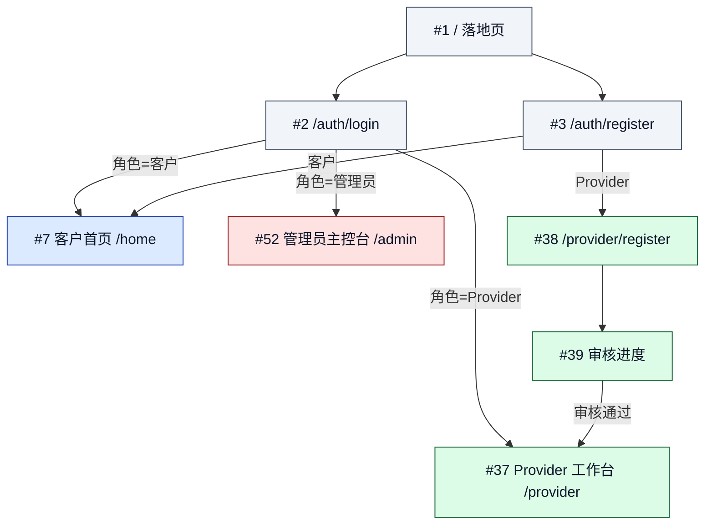
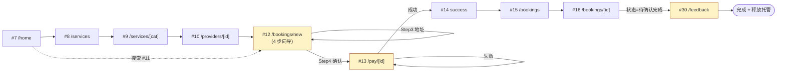
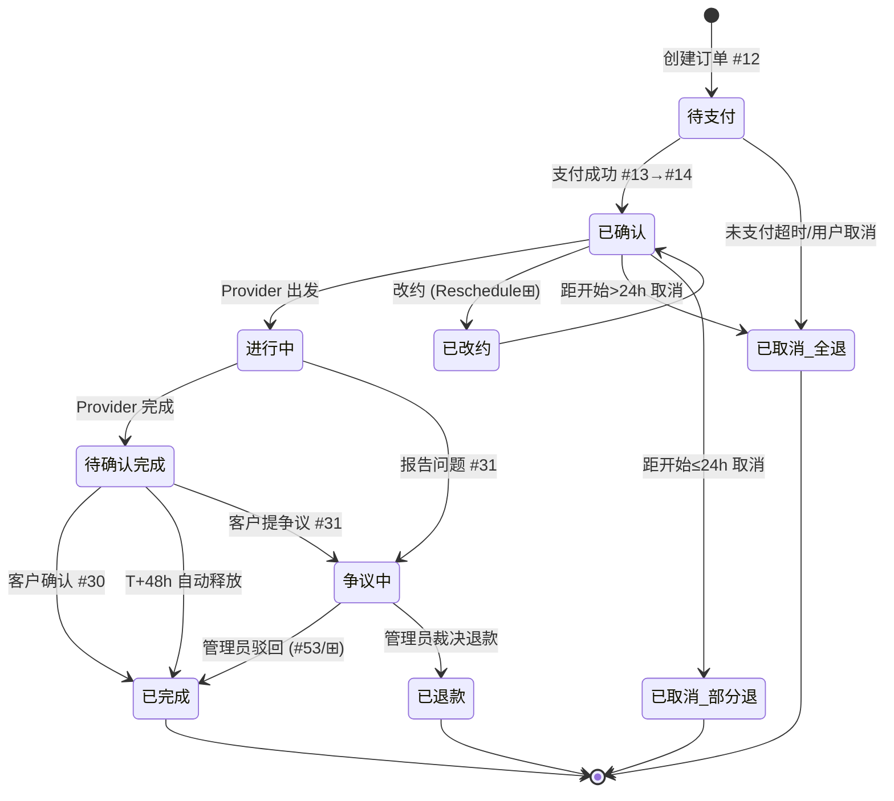
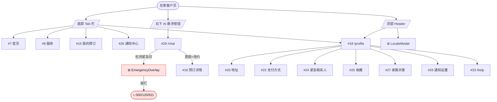
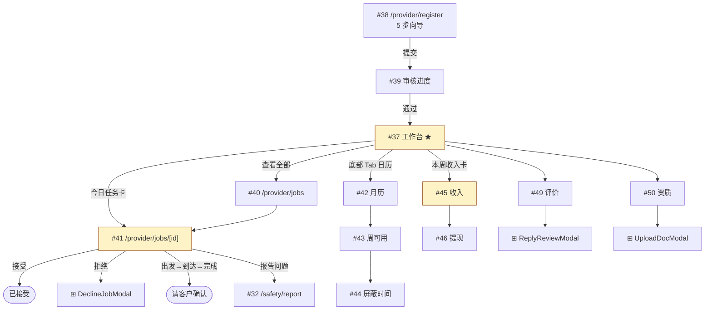
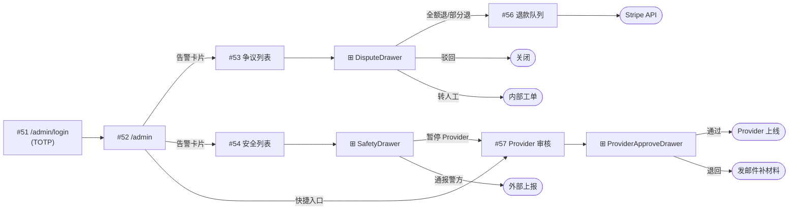
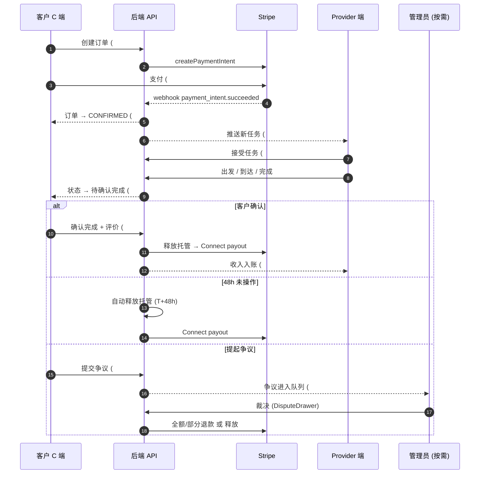

# SilverConnect Global — 页面清单与功能规格

> 配合 [UI_DESIGN.md](UI_DESIGN.md) 使用。本文档负责"有哪些页面、每页做什么"，UI_DESIGN.md 负责"长什么样"。
> 标记说明：📱 移动端、🖥 桌面端、⊞ 模态/抽屉非独立路由、★ MVP 核心路径。

---

## 0. 总览

| 端 | 独立路由页 | 模态/抽屉 | 仅移动 | 仅桌面 | 共用 |
|---|---|---|---|---|---|
| 公共/认证 | 6 | 2 | 0 | 0 | 6 |
| 客户 C 端 | 30 | 8 | 0 | 0 | 30 |
| Provider 端 | 14 | 3 | 0 | 0 | 14 |
| 管理员 A 端 | 16 | 5 | 0 | 16 | 0 |
| 错误兜底 | 2 | 0 | 0 | 0 | 2 |
| **合计** | **68** | **18** | **0** | **16** | **52** |

> **移动端总页面数：52**（公共 6 + 客户 30 + Provider 14 + 错误 2）
> **桌面端总页面数：68**（移动端 52 全部 + 管理员 16）

> Provider 端为响应式，移动桌面同套（出门服务者随身手机用居多）。
> 管理员端桌面优先，移动端不做适配（≥ 1024px 才可访问）。
> 模态/抽屉不计入"页面数"，因为它们附在所属页内。

---

## 1. 公共 / 认证（6 页 + 2 模态）

| # | 路由 | 端 | 类型 | 名称 |
|---|---|---|---|---|
| 1 | `/` | 📱🖥 | 路由 ★ | 落地页（未登录） |
| 2 | `/auth/login` | 📱🖥 | 路由 ★ | 登录 |
| 3 | `/auth/register` | 📱🖥 | 路由 ★ | 注册（角色二选：客户 / Provider） |
| 4 | `/auth/forgot` | 📱🖥 | 路由 | 找回密码 |
| 5 | `/auth/reset?token=` | 📱🖥 | 路由 | 重置密码 |
| 6 | `/auth/verify?token=` | 📱🖥 | 路由 | 邮箱验证回调 |
| ⊞ | AuthModal | 📱🖥 | 模态 | 站内任意位置呼出登录/注册（§7.5） |
| ⊞ | LocaleModal | 📱🖥 | 模态 | Header 国家+语言切换 |

### 1.1 `/` 落地页（未登录）★
**目的**：转化访客成注册客户或 Provider。
**功能**：
- Hero：插画 `S1` + 一句价值主张 + 「Sign in / 登录」「Get started / 开始使用」双 CTA。
- 三栏价值点：`安全审核` `透明定价（含税）` `24/7 AI 协助`。
- 5 大服务图标走马灯（不自动滚）。
- 「Become a helper / 成为服务者」入口跳 §3.2 Provider 注册向导。
- Footer：关于、条款、隐私、客服、备案号（CN 区合规）。

### 1.2 `/auth/login` ★
**功能**：邮箱 + 密码、社交登录（Google / Apple）、忘记密码链接、注册链接、记住我复选框、错误提示（次数限制后显示"X 分钟后再试"）。

### 1.3 `/auth/register` ★
**功能**：第一步选角色（客户 / Provider），第二步邮箱+密码+国家+语言，提交后进入对应端首屏。客户端跳 §2.1 客户首页，Provider 端跳 §3.2 Provider 注册向导。

### 1.4 `/auth/forgot`
**功能**：输入邮箱 → 发送重置链接 → 显示"已发送，请查收"页（含未收到的二次发送 60s 倒计时）。

### 1.5 `/auth/reset`
**功能**：token 校验 → 新密码 + 确认密码 → 强度计 → 提交 → 跳登录。token 失效显示重发链接。

### 1.6 `/auth/verify`
**功能**：自动校验 token → 成功跳客户首页并显示 toast；失败显示"链接失效，重新发送验证邮件"按钮。

---

## 2. 客户 C 端（30 页 + 8 模态）

### 2A. 发现与浏览（5 页）

| # | 路由 | 类型 | 名称 |
|---|---|---|---|
| 7 | `/home` 或 `/` (已登录) | 路由 ★ | 客户首页 |
| 8 | `/services` | 路由 ★ | 服务大类列表 |
| 9 | `/services/[category]` | 路由 ★ | 单类下 Provider 列表 |
| 10 | `/providers/[id]` | 路由 ★ | Provider 详情 |
| 11 | `/search?q=` | 路由 | 搜索结果 |

#### 2.1 `/home` 客户首页 ★
- Hero 问候 + 插画 `S1`。
- 大搜索框（点击跳 `/search`）。
- 5 大类卡（跳 `/services/[category]`）。
- "我最近订过"横滑（跳 `/providers/[id]` 或 `/bookings/[id]`）。
- "推荐 Provider"（跳 `/providers/[id]`）。
- "请评价 X 服务"条幅（仅当有待评价订单，跳 ⊞ FeedbackQuickModal，见 §2L）。
- AI 悬浮按钮（见 UI_DESIGN.md §2.3）。
- 底部 Tab 栏：首页 / 服务 / 预订 / 消息 / 我的。

#### 2.2 `/services` 服务大类
- 5 张大类卡，每卡显示起价区间 + 国别税信息。
- 顶部一句话："价格已含 GST/VAT/HST" 视当前国家而定。

#### 2.3 `/services/[category]` 单类 Provider 列表 ★
- 顶部：类别名 + 价格区间。
- 筛选 chip：评分、距离、语言、周末可用、女性服务者、急救资质。
- 排序下拉：推荐 / 距离最近 / 评分最高 / 价格最低。
- Provider 卡片列表（无限滚动 / 分页 20 条）。
- 空结果：插画 + "调整筛选条件"按钮。

#### 2.4 `/providers/[id]` Provider 详情 ★
- 头像 + 名 + 评分 + 完成单量 + 语言徽章。
- 资质徽章组（验证 / 急救 / 无犯罪 / 保险）。
- 服务范围（地图迷你视图）。
- 提供的服务清单（含价格）。
- 可用时段预览（点击跳预订 Step 2）。
- 评价列表（5 星、含 Provider 回复）。
- 底部 sticky：「立即预订 / Book now」主按钮。

#### 2.5 `/search` 搜索结果
- 搜索框置顶。
- 三 Tab：服务 / Provider / 帮助文章。
- 历史搜索 + 热门搜索（未输入时显示）。

### 2B. 预订流程（5 页 + 1 模态）

| # | 路由 | 类型 | 名称 |
|---|---|---|---|
| 12 | `/bookings/new?provider=&service=` | 路由 ★ | 预订向导（4 步） |
| 13 | `/pay/[bookingId]` | 路由 ★ | 支付页（Stripe Elements） |
| 14 | `/bookings/[id]/success` | 路由 ★ | 支付成功 |
| 15 | `/bookings` | 路由 ★ | 我的预订列表 |
| 16 | `/bookings/[id]` | 路由 ★ | 预订详情 |
| ⊞ | RescheduleModal | 模态 | 改约时间选择器 |

#### 2.6 `/bookings/new` 预订向导 ★
4 步进度条，单页 SPA 切换：
- **Step 1 选服务包**：单选大卡（基础 / 深度 / 全屋），显示时长、价格。
- **Step 2 选时间**：月历 + 时段按钮 + 单次/循环 4 tab。
- **Step 3 选地址**：已存地址列表 + 新增地址表单 + 距离 Provider 估算。
- **Step 4 确认**：价格明细（服务费 / 平台费 / 税 / 合计）+ 取消政策框 + 备注栏 + 「下一步：去支付」。
- 每步可返回上一步且不丢数据；离开提示二次确认。

#### 2.7 `/pay/[bookingId]` 支付页 ★
- 顶部订单摘要（不可编辑）。
- 支付方式三选：Apple Pay / Google Pay / 信用卡（Stripe Elements）。
- 已绑定卡列表 + 「使用新卡」+ 「保存以后用」复选。
- 安全条："🔒 由 Stripe 加密"。
- 底部 sticky：`Pay A$60.50 / 支付 A$60.50` 主按钮。
- 失败状态：红条 + 失败原因 + 「换张卡」「联系银行」「联系客服」。

#### 2.8 `/bookings/[id]/success` 支付成功 ★
- 插画 `S5` + 大字 "已支付 / Paid"。
- 订单号、Provider 联系方式、日期时间提醒。
- 「加入日历」「查看订单」「返回首页」三按钮。
- 提示"我们会在服务前 24h、2h 各推送一次提醒"。

#### 2.9 `/bookings` 我的预订列表 ★
- 三 Tab：`即将进行` / `历史` / `循环`。
- 每条卡片含：日期大字、Provider、服务、状态徽章、金额、3 操作按钮。
- 下拉刷新（移动端）。
- 空状态：插画 `S3` + 「浏览服务 →」。

#### 2.10 `/bookings/[id]` 预订详情 ★
- 状态徽章 + BookingStatusFlow 时间线。
- 服务卡 / 地址卡 / Provider 卡 / 价格明细折叠表 / 备注。
- 操作区按状态切换（见 UI_DESIGN.md §6.5）。
- "我有问题" → 跳 #31 争议提交（§2.25）。
- "报告安全问题" → 跳 #32 安全事件报告（§2.26，仅进行中/已完成显示）。
- 完成后显示评价入口。

### 2C. 循环预订（1 页）

| # | 路由 | 类型 | 名称 |
|---|---|---|---|
| 17 | `/bookings/recurring` | 路由 | 循环订单管理 |

#### 2.11 `/bookings/recurring`
- 列出所有活跃循环订单（每周清洁、每月园艺等）。
- 每条显示：周期、下次日期、Provider、价格、剩余次数。
- 操作：暂停 / 恢复 / 修改时间 / 取消整个循环。
- 暂停时选时间范围（7/14/30 天 / 自定义）。

### 2D. 个人资料（10 页 + 2 模态）

| # | 路由 | 类型 | 名称 |
|---|---|---|---|
| 18 | `/profile` | 路由 ★ | 个人资料主页 |
| 19 | `/profile/edit` | 路由 | 编辑基本信息 |
| 20 | `/profile/addresses` | 路由 | 地址管理 |
| 21 | `/profile/addresses/new` | 路由 | 新增 / 编辑地址 |
| 22 | `/profile/payment` | 路由 ★ | 支付方式 |
| 23 | `/profile/payment/new` | 路由 | 添加新卡（Stripe） |
| 24 | `/profile/emergency` | 路由 | 紧急联系人 |
| 25 | `/profile/favorites` | 路由 | 收藏的 Provider |
| 26 | `/profile/notifications-settings` | 路由 | 通知偏好设置 |
| 27 | `/profile/family` | 路由 | 家属共管（看护视角） |
| ⊞ | DeleteCardConfirm | 模态 | 删卡二次确认 |
| ⊞ | InviteFamilyModal | 模态 | 邀请家属链接生成 |

#### 2.12 `/profile` 主页 ★
- 头像 96px + 姓名 + 当前国家 + 语言 + 编辑按钮。
- 列表入口：地址 / 支付方式 / 紧急联系人 / 收藏 / 家属 / 通知设置 / 帮助 / 隐私设置 / 退出登录。
- 底部"删除账号"小字（跳危险操作流）。

#### 2.13 `/profile/edit`
- 头像、姓名、生日、性别、电话、首选语言、首选 Provider 性别。

#### 2.14 `/profile/addresses`
- 列表：每条 80px，标记"默认"。
- 添加按钮 → §2.15。
- 长按编辑 / 删除。

#### 2.15 `/profile/addresses/new`
- 自动定位 + 地图微缩图 + 详细地址（街道、单元、楼层）+ 门禁说明（备注栏）+ 设为默认开关。

#### 2.16 `/profile/payment` ★
- 已绑定卡列表（卡 brand 图标 + 后 4 位 + 到期 + 默认徽章）。
- 「+ 添加新卡」→ §2.17。
- 删除：长按或右滑 → 确认模态。

#### 2.17 `/profile/payment/new`
- Stripe Elements 嵌入式表单（卡号、有效期、CVC、邮编）。
- 顶部安全提示。
- 「保存为默认」开关。

#### 2.18 `/profile/emergency`
- 联系人列表（姓名、关系、电话）。
- 至少 1 个，最多 3 个。
- 紧急时一键拨打 / 发短信。

#### 2.19 `/profile/favorites`
- 收藏 Provider 卡片列表（同 §2.4 卡片样式）。
- 取消收藏。

#### 2.20 `/profile/notifications-settings`
- 三组开关：Push / SMS / Email。
- 细分类目：预订提醒、支付通知、Provider 变更、营销（默认关）、AI 摘要。

#### 2.21 `/profile/family`
- 家属列表 + 邀请按钮（生成链接，发短信/邮件）。
- 家属权限设置：仅查看 / 可代下单 / 可代支付。
- 移除家属。

### 2E. 通知（1 页）

| # | 路由 | 类型 | 名称 |
|---|---|---|---|
| 28 | `/notifications` | 路由 ★ | 通知中心 |

#### 2.22 `/notifications` ★
- 4 Tab：全部 / 预订 / 支付 / 系统。
- 每条 80px：图标 + 标题 + 摘要 + 时间 + 未读点。
- 顶部"全部标为已读"。
- 右上齿轮跳 §2.20。

### 2F. AI 客服（1 页 + 1 模态）

| # | 路由 | 类型 | 名称 |
|---|---|---|---|
| 29 | `/chat` | 路由 ★ | AI 聊天独立页（移动端常驻入口） |
| ⊞ | ChatModal | 模态 | 桌面端 / 子页面浮窗呼出 |

#### 2.23 `/chat` ★
- 历史会话列表（左侧）+ 当前会话（右侧），移动端切换。
- 输入框 + 语音按钮 + 发送。
- 建议气泡（"改约 / 取消 / 查询价格 / 找客服"）。
- 紧急关键词触发 §2.27 全屏。
- 转人工按钮（右上）。

### 2G. 评价（1 页 + 2 模态）

| # | 路由 | 类型 | 名称 |
|---|---|---|---|
| 30 | `/bookings/[id]/feedback` | 路由 ★ | 评价提交页 |
| ⊞ | FeedbackQuickModal | 模态 | 首页条幅快速评价 |
| ⊞ | ReportReviewModal | 模态 | 举报评价 |

#### 2.24 `/bookings/[id]/feedback` ★
- 5 星点击区。
- 多选 chip：准时 / 专业 / 干净 / 态度好 / 价格合理。
- 可选文字 + 上传照片（≤5）。
- 是否推荐复选。
- 提交后跳"释放托管支付"确认页（FR-04）。

### 2H. 争议与安全（2 页）

| # | 路由 | 类型 | 名称 |
|---|---|---|---|
| 31 | `/bookings/[id]/dispute` | 路由 ★ | 争议提交 |
| 32 | `/safety/report` | 路由 | 安全事件报告 |

#### 2.25 `/bookings/[id]/dispute` ★
- 单选争议类型大卡。
- 描述（≥20 字）。
- 证据上传（≤10）。
- 期望结果：重做 / 部分退款 / 全额退款。
- 提示：48h 回复、托管款暂不释放。
- 提交后跳详情页显示 "DisputeOpen" 状态。

#### 2.26 `/safety/report`
- 严重度三选：一般 / 中等 / 紧急。
- 紧急 → 跳 §2.27。
- 其他 → 表单（时间、描述、证据、是否要警方介入）。

### 2I. 紧急（1 全屏）

| # | 路由 | 类型 | 名称 |
|---|---|---|---|
| ⊞ | EmergencyOverlay | 全屏覆盖 | 紧急联系卡 |

#### 2.27 紧急覆盖
- AI 检测关键词或用户主动触发。
- 红底 + 国家自动选号（AU 000 / CN 120 + 110/119 / CA 911）。
- 一键拨打 + 通知紧急联系人。
- 关闭长按 2s。

### 2J. 帮助（2 页）

| # | 路由 | 类型 | 名称 |
|---|---|---|---|
| 33 | `/help` | 路由 | 帮助中心 |
| 34 | `/help/[articleId]` | 路由 | 帮助文章详情 |

#### 2.28 `/help`
- 搜索框。
- 分类入口：预订 / 支付 / 退款 / 账号 / 安全 / 其他。
- 热门问题前 10。
- 底部"联系客服"→ AI 聊天 / 转人工 / 电话。

#### 2.29 `/help/[articleId]`
- 文章正文，长文章用 TOC。
- 底部"是否有帮助"反馈。
- 相关文章。

### 2K. 设置（2 页）

| # | 路由 | 类型 | 名称 |
|---|---|---|---|
| 35 | `/settings/privacy` | 路由 | 隐私设置 |
| 36 | `/settings/account` | 路由 | 账号管理 |

#### 2.30 `/settings/privacy`
- 数据导出（GDPR / PIPL）。
- 第三方 cookie 偏好。
- 营销追踪开关。

#### 2.31 `/settings/account`
- 修改密码。
- 修改邮箱（需验证）。
- 修改电话（需 OTP）。
- 删除账号（30 天冷静期，输入密码 + 文字确认）。

### 2L. 客户端模态汇总

| # | 名称 | 触发位置 |
|---|---|---|
| ⊞1 | LocaleModal | Header 国家/语言 |
| ⊞2 | RescheduleModal | 预订详情/列表 |
| ⊞3 | DeleteCardConfirm | 支付方式 |
| ⊞4 | InviteFamilyModal | 家属共管 |
| ⊞5 | ChatModal | 任意页右下 AI 按钮 |
| ⊞6 | FeedbackQuickModal | 首页评价条幅 |
| ⊞7 | ReportReviewModal | Provider 详情评价区 |
| ⊞8 | EmergencyOverlay | AI 检测 / 用户触发 |

---

## 3. Provider 端（14 页 + 3 模态）

### 3A. 注册与首屏（3 页）

| # | 路由 | 类型 | 名称 |
|---|---|---|---|
| 37 | `/provider` | 路由 ★ | Provider 工作台首页 |
| 38 | `/provider/register` | 路由 ★ | 注册向导（5 步） |
| 39 | `/provider/onboarding-status` | 路由 | 审核进度查询 |

#### 3.1 `/provider` 工作台 ★
- 问候 + 日期。
- 本周收入卡（含托管中、已到账，跳 §3.9 收入总览）。
- 今日任务列表（最多 3 单可见，余下"查看全部"跳 §3.4 任务列表）。
- "开始/完成"主 CTA（按当前任务状态切换）。
- 底部 Tab：首页 / 任务 / 日历 / 收入 / 我的。

#### 3.2 `/provider/register` ★
5 步：
1. 基本信息（姓名、电话、地址、自我介绍）
2. 资质上传（无犯罪、急救证、保险，国别要求不同）
3. 服务区域（地图画圈 + 选服务大类）
4. 可用时段（首次默认全周可用，后续可改）
5. Stripe Connect 账号绑定

#### 3.3 `/provider/onboarding-status`
- 5 步审核状态时间线：信息提交 / 资质审核 / 背调 / Stripe 验证 / 上线。
- 每步显示状态、时间戳、需要补充材料的回链。

### 3B. 任务管理（3 页 + 1 模态）

| # | 路由 | 类型 | 名称 |
|---|---|---|---|
| 40 | `/provider/jobs` | 路由 ★ | 任务列表 |
| 41 | `/provider/jobs/[id]` | 路由 ★ | 任务详情 |
| 42 | `/provider/calendar` | 路由 ★ | 月历视图 |
| ⊞ | DeclineJobModal | 模态 | 拒绝任务（带理由） |

#### 3.4 `/provider/jobs` ★
- 三 Tab：今天 / 本周 / 历史。
- 每条任务卡：时间、客户、服务、地址、距离、金额、状态。

#### 3.5 `/provider/jobs/[id]` ★
- 任务详情：时间、客户姓名 + 头像、地址（导航按钮）、电话（拨打按钮）、服务说明、特殊备注、价格明细。
- 状态按钮：接受 / 拒绝（带理由）/ 出发 / 到达 / 完成。
- 完成时弹出"请客户确认"二次确认。
- "客户取消"提示 + 取消政策对照（是否进入 24h 内）。
- "报告问题"链接（无人开门、客户态度差等），跳 #32 安全事件报告（与客户共用，提交后均进入管理员 #54 安全列表）。

#### 3.6 `/provider/calendar`
- 月历，标注已订/可用/屏蔽。
- 点击日期跳 §3.7 周历调整。

### 3C. 排班与可用性（2 页）

| # | 路由 | 类型 | 名称 |
|---|---|---|---|
| 43 | `/provider/availability` | 路由 ★ | 周可用时段 |
| 44 | `/provider/blocked-times` | 路由 | 屏蔽时间（休假等） |

#### 3.7 `/provider/availability` ★
- 周视图，每天三段（早/中/晚）大块切换。
- 默认时段模板（"每周一三五早上"）+ 一键应用。

#### 3.8 `/provider/blocked-times`
- 列出所有未来屏蔽时间段。
- 「+ 新增屏蔽」选起止时间 + 原因（休假/培训/其他）。
- 已订时段不可屏蔽，提示先取消。

### 3D. 收入与提现（2 页）

| # | 路由 | 类型 | 名称 |
|---|---|---|---|
| 45 | `/provider/earnings` | 路由 ★ | 收入总览 |
| 46 | `/provider/payouts` | 路由 ★ | 提现记录与设置 |

#### 3.9 `/provider/earnings` ★
- 时间筛选：本周 / 本月 / 自定义。
- 数据：总收入、托管中、已到账、平台抽成、净收入。
- 趋势折线图（移动端简化为柱状）。
- 按订单导出 CSV。

#### 3.10 `/provider/payouts` ★
- 已到账记录（金额、日期、Stripe transfer id）。
- Stripe Connect 账号状态 + 重新验证按钮。
- 提现频率设置（每日 / 每周 / 手动）。

### 3E. 个人 / 评价（4 页 + 2 模态）

| # | 路由 | 类型 | 名称 |
|---|---|---|---|
| 47 | `/provider/profile` | 路由 | 个人主页（同客户视角） |
| 48 | `/provider/services` | 路由 | 我提供的服务与定价 |
| 49 | `/provider/reviews` | 路由 ★ | 收到的评价 |
| 50 | `/provider/compliance` | 路由 | 资质材料管理 |
| ⊞ | ReplyReviewModal | 模态 | 回复评价 |
| ⊞ | UploadDocModal | 模态 | 上传新资质 |

#### 3.11 `/provider/profile`
- 公开主页预览（与客户看到的 §2.4 一致）。
- 编辑：头像、自我介绍、语言、性别（可不公开）。

#### 3.12 `/provider/services`
- 已选服务列表 + 各自定价（在国别推荐价区间内）。
- 添加/移除服务。

#### 3.13 `/provider/reviews` ★
- 评价列表，可筛选 1-5 星。
- 平均分、好评率、各维度评分（准时/专业/干净/态度/价格）。
- 每条可"回复"（一次）。
- 可"举报"恶意评价。

#### 3.14 `/provider/compliance`
- 已上传资质卡片：类型、有效期、状态（有效/即将过期/已过期）。
- 即将过期 30 天内黄字提醒。
- 重新上传 → ⊞ UploadDocModal（§3F）。

### 3F. Provider 端模态汇总

| # | 名称 | 触发 |
|---|---|---|
| ⊞1 | DeclineJobModal | 任务详情拒绝 |
| ⊞2 | ReplyReviewModal | 评价列表 |
| ⊞3 | UploadDocModal | 资质管理 |

---

## 4. 管理员 A 端（16 页 + 5 抽屉，桌面专属）

### 4A. 入口（1 页）

| # | 路由 | 类型 | 名称 |
|---|---|---|---|
| 51 | `/admin/login` | 路由 ★ | 管理员登录（独立认证） |

#### 4.1 `/admin/login`
- 邮箱 + 密码 + TOTP 二次验证（强制）。
- IP 白名单提示（可选）。
- 失败 5 次锁定 15 分钟。

### 4B. 主控台（1 页）

| # | 路由 | 类型 | 名称 |
|---|---|---|---|
| 52 | `/admin` | 路由 ★ | 主控台 Overview |

#### 4.2 `/admin` ★
- 关键指标卡：今日新订单 / 待处理争议 / 待审 Provider / 安全事件 / GMV / AI 化解率。
- 异常告警条（支付失败率 / Stripe webhook 延迟 / 异常事件激增）。
- 快捷入口卡。

### 4C. 争议与安全（4 页 + 2 抽屉）

| # | 路由 | 类型 | 名称 |
|---|---|---|---|
| 53 | `/admin/disputes` | 路由 ★ | 争议列表 |
| 54 | `/admin/safety` | 路由 ★ | 安全事件列表 |
| 55 | `/admin/reports` | 路由 | 评价举报队列 |
| 56 | `/admin/refunds` | 路由 | 退款队列 |
| ⊞ | DisputeDrawer | 抽屉 ★ | 争议详情 |
| ⊞ | SafetyDrawer | 抽屉 ★ | 安全事件详情 |

#### 4.3 `/admin/disputes` ★
- 数据表：ID、订单、争议类型、双方、金额、状态、提交时间、SLA 倒计时。
- 筛选：状态、SLA、国家、争议类型。
- 行点击 → DisputeDrawer。

#### 4.4 DisputeDrawer ★
- 客户描述 + 证据画廊。
- Provider 回应（如有）。
- 决策：全额退 / 部分退（含金额输入）/ 驳回 / 转人工。
- 操作日志时间线。
- 内部备注（仅管理员可见）。

#### 4.5 `/admin/safety` ★
- 类似争议列表，按严重度排序。

#### 4.6 SafetyDrawer
- 报告人、被报告人、严重度、描述、证据。
- 操作：警告 / 暂停 Provider / 永久封禁 / 通报警方 / 关闭。

#### 4.7 `/admin/reports`
- 评价举报队列：举报人、被举报评价、原因、处理。
- 操作：保留 / 删除评价 / 警告评价者。

#### 4.8 `/admin/refunds`
- 待处理退款列表（争议结果或自助退款触发）。
- Stripe 退款执行 + 状态回流。

### 4D. Provider 审核（2 页 + 1 抽屉）

| # | 路由 | 类型 | 名称 |
|---|---|---|---|
| 57 | `/admin/providers` | 路由 ★ | Provider 审核队列 |
| 58 | `/admin/providers/[id]` | 路由 | Provider 全档案 |
| ⊞ | ProviderApproveDrawer | 抽屉 ★ | 单 Provider 审核操作 |

#### 4.9 `/admin/providers` ★
- 数据表：姓名、国家、申请时间、5 步审核进度、状态。
- 筛选：状态、国家、缺失材料类型。

#### 4.10 ProviderApproveDrawer ★
- 资料、资质材料预览。
- 决策：通过 / 退回（带理由模板）/ 拒绝 / 暂挂。
- 资质项逐条勾选 + 备注。

#### 4.11 `/admin/providers/[id]`
- 完整档案（含历史订单、收入、评价、合规、争议数）。
- 暂停 / 恢复 / 永久封禁。

### 4E. 客户与订单（3 页 + 1 抽屉）

| # | 路由 | 类型 | 名称 |
|---|---|---|---|
| 59 | `/admin/customers` | 路由 | 客户列表 |
| 60 | `/admin/customers/[id]` | 路由 | 客户详情 |
| 61 | `/admin/bookings` | 路由 | 订单监控 |
| ⊞ | CustomerDrawer | 抽屉 | 客户快速操作 |

#### 4.12 `/admin/customers`
- 列表：姓名、国家、注册时间、订单数、累计消费、风险标记。
- 行 → CustomerDrawer。

#### 4.13 `/admin/customers/[id]`
- 全档案：订单、支付、争议、家属、设备、登录历史。
- 操作：重置密码邮件、合并账号、删除（GDPR）。

#### 4.14 `/admin/bookings`
- 实时订单流。
- 异常筛选：长时间未确认、托管超时未释放、多次改约。

#### 4.15 CustomerDrawer
- 联系信息、最近订单、操作快捷。

### 4F. 财务与报表（2 页）

| # | 路由 | 类型 | 名称 |
|---|---|---|---|
| 62 | `/admin/payments` | 路由 ★ | 支付与对账 |
| 63 | `/admin/analytics` | 路由 ★ | 数据分析 |

#### 4.16 `/admin/payments` ★
- Stripe 入账 / 出账明细。
- 平台抽成、税收报表（按国别）。
- 异常交易（chargeback、可疑模式）。
- 导出 CSV / PDF。

#### 4.17 `/admin/analytics` ★
- 多图表 dashboard：周订单（按国别）、复购率、平均评分、争议率、AI 化解率、支付成功率（对应 PRD §7 成功指标）。
- 时间范围：日/周/月/季/年。
- 导出图片。

### 4G. AI 与知识库（2 页 + 1 抽屉）

| # | 路由 | 类型 | 名称 |
|---|---|---|---|
| 64 | `/admin/ai/conversations` | 路由 | AI 会话审计 |
| 65 | `/admin/ai/kb` | 路由 | 知识库与模板 |
| ⊞ | ConversationDrawer | 抽屉 | 单会话回放 |

#### 4.18 `/admin/ai/conversations`
- 会话列表：用户、意图、是否化解、是否升级、紧急触发。
- 筛选：未化解、紧急、低满意度。
- 行 → ConversationDrawer 全文回放。

#### 4.19 `/admin/ai/kb`
- 知识库条目（FAQ + 模板）。
- 增 / 改 / 删 + 国别多语言版本管理。
- 模板变量插入（`{{customer_name}}` 等）。

### 4H. 系统设置（1 页）

| # | 路由 | 类型 | 名称 |
|---|---|---|---|
| 66 | `/admin/settings` | 路由 | 系统设置 |

#### 4.20 `/admin/settings`
- 平台费率（按国别）。
- 取消政策窗口（24h 等）。
- 紧急关键词维护。
- 管理员账号与权限。
- 审计日志。

### 4I. 管理员端抽屉汇总

| # | 名称 | 触发 |
|---|---|---|
| ⊞1 | DisputeDrawer | 争议列表 |
| ⊞2 | SafetyDrawer | 安全列表 |
| ⊞3 | ProviderApproveDrawer | Provider 审核 |
| ⊞4 | CustomerDrawer | 客户列表 |
| ⊞5 | ConversationDrawer | AI 会话 |

---

## 5. 设计 / 状态收口（2 页）

| # | 路由 | 类型 | 名称 |
|---|---|---|---|
| 67 | `/oops` | 路由 | 通用错误兜底页（500 / chunk 加载失败） |
| 68 | `/404` | 路由 | 404 |

两页只承载错误展示 + 返回首页 + 联系客服按钮。

---

## 6. 出图分批建议

按 MVP 关键路径优先级（★ = 必出）：

### Sprint 1 — 客户黄金路径（14 屏）
#7 首页 / #8 服务大类 / #9 单类 Provider 列表 / #10 Provider 详情 / #12 预订向导 4 步 / #13 支付 / #14 支付成功 / #15 我的预订 / #16 预订详情 / #28 通知中心 / #29 AI 聊天

### Sprint 2 — 信任与回流（10 屏）
#2 登录 / #3 注册 / #18 个人资料 / #22 支付方式 / #30 评价 / #31 争议 / #32 安全事件 / ⊞ EmergencyOverlay / #25 收藏 / #26 通知设置 / #33 帮助首页

### Sprint 3 — Provider 端（10 屏）
#38 注册向导 / #37 工作台 / #40 任务列表 / #41 任务详情 / #42 月历 / #43 周可用 / #45 收入 / #46 提现 / #49 评价 / #50 资质

### Sprint 4 — 管理员（8 屏）
#51 登录 / #52 主控台 / #53 争议列表 / ⊞ DisputeDrawer / #54 安全列表 / ⊞ ProviderApproveDrawer / #56 退款 / #63 数据分析

### Sprint 5 — 长尾（其余所有页）
家属共管 / 循环订单 / 隐私设置 / 帮助文章 / KB / 系统设置 / Provider 个人主页与服务定价 / 客户与订单监控 / AI 会话审计 / #67 #68 错误兜底 等。

---

## 7. 状态机关键迁移（非页面，提示给前后端对齐）

**Booking**：`PENDING/UNPAID → PENDING/PAID → CONFIRMED → IN_PROGRESS → AWAITING_CONFIRMATION → COMPLETED`
旁路：`CANCELLED_BY_CUSTOMER`（细分 full_refund / partial_refund）/ `CANCELLED_BY_PROVIDER` / `DISPUTED` / `REFUNDED`
对应 §8.3 状态图节点：`已取消_全退` = CANCELLED_BY_*+full_refund，`已取消_部分退` = CANCELLED_BY_CUSTOMER+partial_refund，`已退款` = REFUNDED。

**Provider onboarding**：`SUBMITTED → KYC_REVIEW → BACKGROUND_CHECK → STRIPE_PENDING → ACTIVE`
旁路：`REJECTED` / `SUSPENDED`

**Dispute**：`OPEN → UNDER_REVIEW → RESOLVED_REFUND_FULL/PARTIAL/DENIED → CLOSED`

每个状态对应的页面展示与按钮可见性见对应页 §。

---

## 8. 页面流程图

> 用 Mermaid 渲染，VSCode / GitHub / GitLab 可直接预览。节点编号对应本文档 §1–§4 的页面 #。

### 8.1 总体导航地图（四端入口）

### 8.2 客户黄金路径：发现 → 预订 → 支付 → 完成 ★

### 8.3 客户预订生命周期（含异常旁路）

### 8.4 客户辅助流程（资料、通知、AI、紧急）

### 8.5 Provider 端流程

### 8.6 管理员端流程（争议处理为例）

### 8.7 跨端协作时序：一次完整服务交易

### 图例

- **节点颜色**：蓝=客户端，绿=Provider 端，红=管理员端，灰=公共
- **边类型**：实线=主路径，虚线=快捷/可选路径
- **节点编号** `#N` 对应 §1–§4 路由表中的页面序号
- **⊞** = 模态或抽屉，不占独立路由

